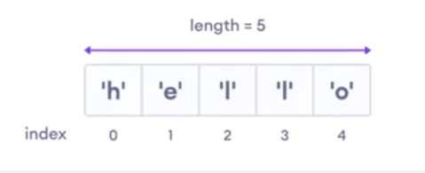

# Array

### Reja:

<details>
    <summary>Array</summary>

> <br> 💡 **Array -** bir vaqtning o'zida bir nechta elementlarni o'zida saqlashi mumkin bo'lgan obyekt. Quyida <span style="color: coral">language</span> nomli, uch elementdan tashkil topgan array ko'rsatilgan   <br><br>

````javascript
    const language = ['js', 'java', 'go'];
````

<br>

<details>
    <summary>Array yaratish</summary>

* Literal

> <br> 💡 Array yaratishning eng oson usuli array literal hisoblanib, to'rtburchak qavslardan ([]) foydalanib yaratiladi <br><br>

````javascript
    const languages = ['java', 'js', 'go'];
````

<br>

* new kalit so'zidan foydalanib:

> <br> 💡 JavaScript dasturlash tilida arraylarni <span style="color: coral;">new</span> kalit so'zidan foydalanib yaratish imkoniyati mavjud <br><br>

````javascript
    const languages = new Array('java', 'js', 'go');
````

<br>

> <br> 💡 Array o'zida turli xil qiymatlarni saqlashi mumkin <br><br>

````javascript
    // bo'sh array
    const emptyArray = [];

    // number array
    const numbersArray = [1, 2, -9, 2];

    // string array
    const stringsArray = ['js', 'java', 'go'];

    // aralash array 
    const mixedArray = ['js', 7, false, null];

````

</details>
<details>
    <summary>Array elementini olish</summary>

> <br> 💡 Array elementlarini uning indexlaridan foydalanib olish mumkin  <br><br>



<br>

> <br> 💡 Array elementlarining indexi 0 dan boshlanadi <br><br>

````javascript
    const helloArray = ['h', 'e', 'l', 'l', 'o'];

    // birinchi qiymat
    const firstElement = helloArray[0]; // 'h'

    // uchinchi qiymat
    const thirdElement = helloArray[2]; // l'
````


</details>
<details>
    <summary>Array element qo'shish</summary>

> <br> 💡 Arrayga element qo'shish uchun push() yoki unshift() array methodlaridan foydalanish mumkin <br><br>

<br>

<span style="color: coral">push()</span> methodi yordamida arrayning oxiriga element qo'shish mumkin

````javascript
    const languages = ['js', 'java'];
    languages.push('go');
    console.log(languages); // ['js', 'java', 'go']
````

<br>

<span style="color: coral">unshift()</span> methodi yordamida arrayning boshiga element qo'shish mumkin

````javascript
    const languages = ['js', 'java'];
    languages.unshift('go');
    console.log(languages); // ['go', 'js', 'java']
````    

</details>
<details>
    <summary>Array elementini o'zgartirish</summary>

> <br> 💡 Array index laridan foydalangan holda, uning element qiymatini o'zgartirish imkoniyati mavjud <br><br>

````javascript
    const languages = ['js', 'java', 'go'];
    languages[2]('swift');
    console.log(languages); // ['js', 'java', 'swift']
````  

</details>
<details>
    <summary>Array elementini o'chirish</summary>

> <br> 💡 <span style="color: coral;">pop()</span> methodidan foydalanib array ichidagi oxirgi elementni o'zgartirish imkoniyati mavjud. Method o'chirilgan elementni qaytaradi <br><br>

````javascript
    const languages = ['js', 'java', 'go', 'swift'];
    const deletedElement = languages.pop();
    console.log(languages) // ['js', 'java', 'go']
    console.log(deletedElement); // swift
````  

<br>

> <br> 💡 <span style="color: coral;">shift()</span> methodidan foydalanib array ichidagi birinchi elementni o'zgartirish imkoniyati mavjud. Method o'chirilgan elementni qaytaradi <br><br>

````javascript
    const languages = ['js', 'java', 'go', 'swift'];
    const deletedElement = languages.shift();
    console.log(languages) // ['java', 'go', 'swift]
    console.log(deletedElement); // js
````  


</details>
<details>
    <summary>Array uzunligini o'zgartirish</summary>

> <br> 💡 Arrayning uzunligini, ya'ni uning elementlar sonini aniqlash uchun <span style="color: coral;">length</span> xossasidan foydalaniladi <br><br>

````javascript
    const languages = ['js', 'java', 'go', 'swift'];
    console.log(languages.length);
````

</details>


</details>

