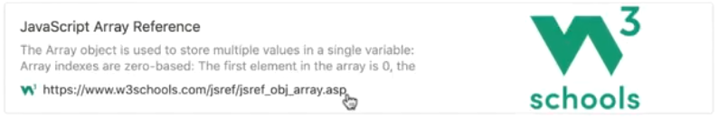
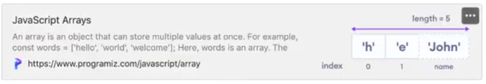

# Array methods

### Reja:

<details>
    <summary>Methods<summary>

> <br> 💡 JavaScript dasturlash tilida array bilan ishlashni osonlashtiradigan maxsus methodlar mavjud <br><br>

|Method|Tavsifi|Immutable (O'zgarmas)|
|-|-|-|
|concat()|Ikki yoki undan ortiq arraylarni birlashtirib, natijani qaytaradi|.|
|indexOf()|array ichidan elementni qidirib, uning index ini qaytaradi|.|
|find()|Birinchi bo'lib shartni bajargan array elementini qaytaradi. Array ichidagi elementni qidirishda foydalaniladi|.|
|findIndex()|Birinchi bo'lib shartni bajargan array elementini indexini qaytaradi. Array ichidagi elementni indexini qidirishda foydalaniladi|.|
|forEach()|Arrayning har bir elementini aylanib chiqishda foydalaniladi|.|
|map()|Arrayning har bir elementi ustida nimadir amal bajarishda ishlatilad va yangi array qaytaradi|.|
|filter()|berilgan shartni bajargan elementlarni saralab olib, yangi array qaytaradi|.|
|includes()|massivda ko'rsatilgan element mavjudligini tekshirishda foydalaniladi|.|
|push()|massivning oxiriga element qo'shish uchun foydalaniladi va massivning yangi uzunligini qaytaradi||
|unshift()|massivning boshiga element qo'shish uchun foydalaniladi va massivning yangi uzunligini qaytaradi||
|pop()|massivning oxirgi elementini olib tashlaydi va olib tashlangan elementni qaytaradi||
|shift()|massivning birinchi elementini olib tashlaydi va olib tashlangan elementni qaytaradi||
|sort()|elementni alfavit tartibida, satrlar sifatida va o'sish tartibida tartiblaydi||
|slice()|massivning ko'rsatilgan qismini tanlab, qaytaradi|.|
|splice()|massivning mavjud elementini olib tashlaydi yoki almashtiradi yoki/va yangi elementlarni qo'shadi||

<br>

### Qo'shimcha foydalanish uchun saytlar: 👇

[](https://www.w3schools.com/jsref/jsref_obj_array.asp)

<br>

[](https://www.programiz.com/javascript/array)


Misollar:

````javascript
    // concat()
    const array1 = [1, 4];
    const array2 = [2, 3, 7];
    const result = array1.concat(array2);
    console.log(result);  // [1, 4, 2, 3, 7]

    // find()
    const foundValue = result.find(num => num === 2);
    console.log(foundValue) // 2

    // filter()
    const filteredValues = result.filter(num => num > 5);
    console.log(filteredValues); // [7]

    // map()
    const mapValues = result.map(num => "Son " + num);
    console.log(mapValues); // [Son 1, Son 4, ... , Son 7]

    // sort()
    result.sort((num1, num2) => num1 - num2);
    console.log(result);  // [1, 2, 3, 4, 7]
    result.sort((num1, num2) => num2 - num1);
    console.log(result);  // [7, 4, 3, 2, 1]


````

</details>