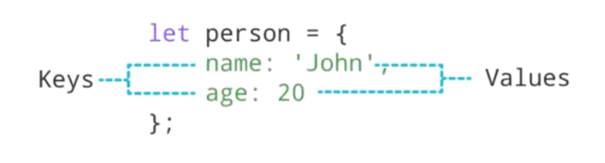

# Objects

### Reja:

<details>
    <summary>Objects</summary>

> <br> 💡 **JavaScript object -** bir nechta ma'lumot to'plamlarini o'zida saqlashga imkon beruvchi ma'lumot turi (data-type)<br><br>

<br>

````javascript
    const dasturchi = {
        ism: 'Javohir',
        yosh: 24
    }
````

<details>
    <summary>Object e'lon qilish (yaratish)</summary>

> <br> 💡 Objectlar figuralik qavslar ({}) yordamida yaratilinib, har bir xossasi (property) **kalit-qiymat** ko'rinishiga ega bo'ladi <br><br>

<br>

````javascript
    const dasturchi = {
        ism: 'Javohir',
        yosh: 24
    }
    console.log(typeof dasturchi);
````



</details>
<details>
    <summary>Object xossasini olish</summary>

> <br> 💡 Xossaning qiymatini kalit yordamida olish imkoniyati mavjud <br><br>

<br>

* **Dot** **(.)** belgisidan foydalanib:

````javascript
    const dasturchi = {
        ism: 'Javohir',
        yosh: 24
    }
    console.log(dasturchi.ism);
````

<br>

* **Qavs ([])** belgisidan foydalanib:

````javascript
    const dasturchi = {
        ism: 'Javohir',
        yosh: 24
    }
    console.log(dasturchi['ism']);
````

</details>
<details>
    <summary>Nested(ichma-ich) obyektlar</summary>

> <br> 💡 Object ichida boshqa objectni saqlashi mumkin <br><br>

````javascript
    const dasturchi = {
        ism: 'Javohir',
        yosh: 24,
        manzil: {
            mamlakat: 'Uzbekistan',
            shahar: 'Tashkent',
            uy: 7
        }
    }

    console.log(dasturchi.ism);  // Javohir
    console.log(dasturchi.manzil.shahar) // Tashkent
````

<br>

</details>
<details>
    <summary>Object methodlari</summary>

> <br> 💡 Object o'z ichida funksiyalarni saqlashi mumkin va ular methodlar deb nomlanadi <br><br>

````javascript
    const dasturchi = {
        ism: 'Javohir',
        yosh: 24,
        sayHello: function() {
            console.log('Hello guys');
        }
    }

    dasturchi.sayHello();
````
    
<br>

</details>

</details>