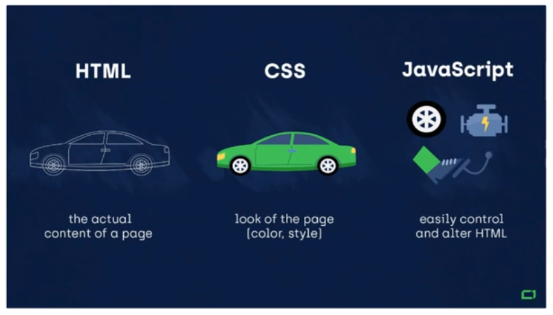
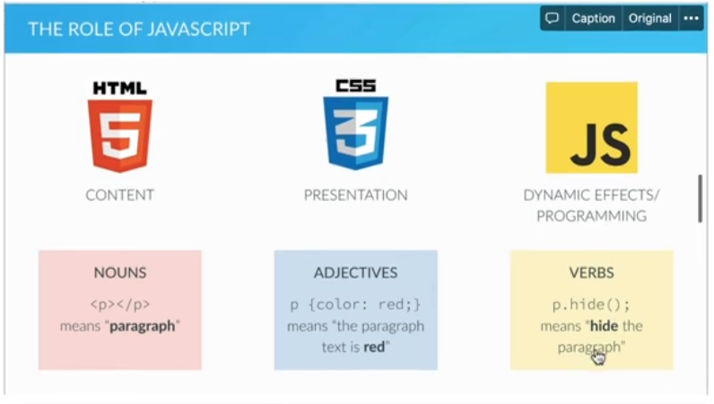
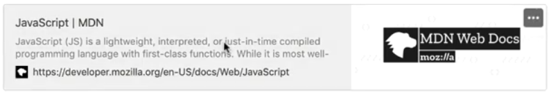
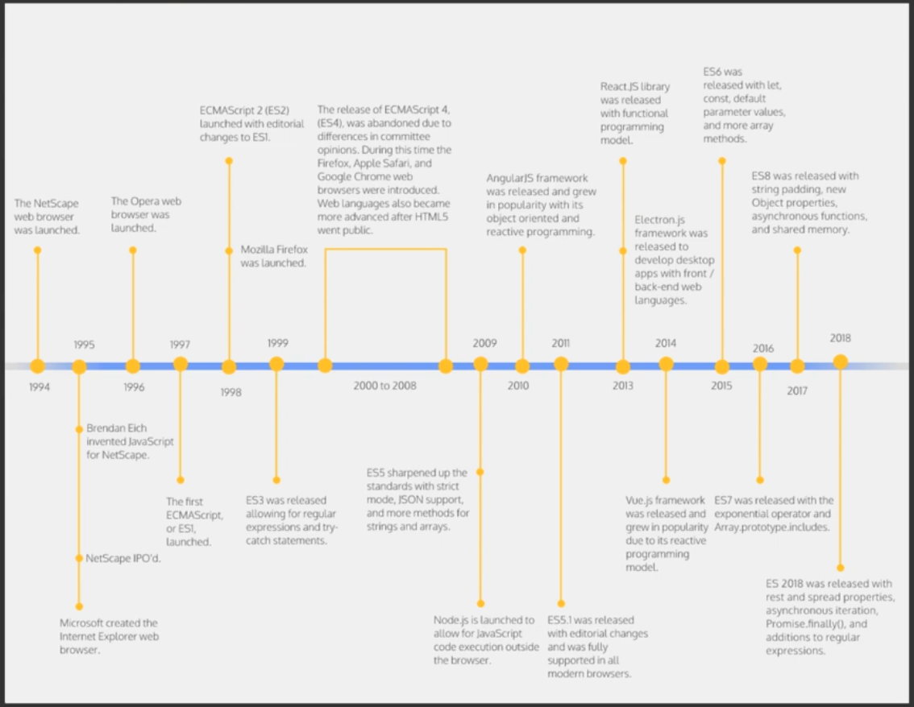
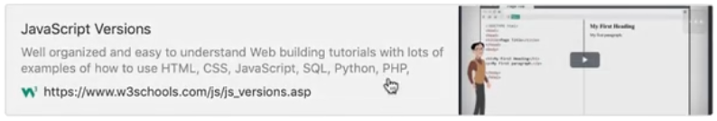

# 2. JavaScript va uning versiyalari
### Reja:

JavaScript haqida

>   💡**JavaScript -** web uchun maxsus yuqori darajadagi (high-level) dasturlash tili. Uning yordamida HTML va CSS ni dinamik ravishda o'zgartirish mumkin.    

 

### Hayotiy o'xshatish
#### Avtomobilga o'xshatish

 

>  💡 Web asoslarini kundalik ishlatiladigan tizimga o'xshatadigan bo'lsak, HTML - ot(noun), CSS - sifat (adjective), JS - fe'l(verb) va'zifasini bajaradi
  

 

#### Kundalik ishlatadigan tilga o'xshatish

  

### Qo'shimcha foydalanish uchun sayt: 👇
### 

    
Amaliyotda qo'llanilishi

---

* **Frontent Development -** JavaScript yordamida web sahifada dinamik ko'rinishda qo'shimchalar qo'shish, masalan matn va kontentni o'zgartirish, rasmlarni o'lchovini o'zgartirish va h.k. Undan tashqari JS Framework lar yordamida web saytlar ishlar chiqish jarayonini ancha tez va oson amalga oshirish imkoniyati mavjud. 
---
* **Backend Development -** JS ga asoslangan Node JS texnologiyasi orqali backend ya'ni server-side dasturlashni amalga oshirish imkoniyati mavjud

---

* **Mobile Application Development -** ReactNative va shunga o'xshash texnologiyalar orqali Hybrid ko'rinishda mobile ilovalar yaratish imkoniyati mavjud.

---

* **Game development -** Online o'yinlar yaratishda JavaScript ham faol tarzda ishlatiladi

---

  

    
JavaScript versiyalari

     
    
### JavaScript vs EcmaScript 

>  💡  **JavaScript -** umumiy maqsadga yo'naltirilgan sripting til bo'lib, EcmaScript tomonidan belgilangan spetsifikatsiyalarga javob beradi. Boshqacha qilib aytganda, EcmaScript scripting til uchun reja (blueprint, standart) bo'lsa, JavaScript esa bu script ning amalga oshirilishidir.   

 

 

### Qo'shimcha foydalanish uchun sayt: 👇

 

### Java != JavaScript

>  ❗JavaScript Netspace ning Java appletlarini qo'llab quvvatlashidan kelib chiqqan. Ko'plar bu nomni marketing uchun yurish deb ham atashadi va shu orqali o'sha davrda juda mashhur bo'lgan Java dasturlash tilidan foydalanib, e'tibor tortishga urinishgan deb aytiladi   

