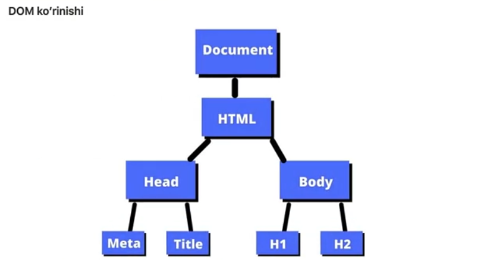
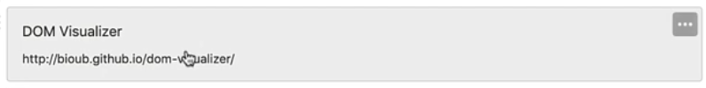
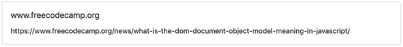

# DOM

### Reja:

<details>
    <summary>DOM</summary>

> <br> 💡 **DOM (Document Object Model) -** dasturlash interface bo'lib u yordamida hujjatda elementlar yaratish, o'zgartirish va o'chirish imkoniyati mavjud. Undan tashqari elementga hodisalar(event) qo'shish orqali, sahifamizni interaktiv qilish imkoniyati mavjud. <br><br>

> <br> 💡 DOM HTML hujjatini tugunlar daraxti **(tree of nodes)** sifatida ko'radi. Tugun **(node)** HTML elementini ifodalaydi <br><br>

> <br> 💡 DOM brauzer yordamida avtomatik ravishda yangilanadi <br><br>

---

### Misol

<br>

#### Kod:

````html
    <!DOCTYPE html>
    <html lang="en">
        <head>
            <meta charset="UTF-8">
            <meta name="viewport" content="width=device-width, initial-scale=1.0">
            <meta http-equiv="X-UA-Compatible" content="ie=edge">
            <title>DOM daraxt ko'rinishi</title>
        </head>
        <body>
            <h1>DOM daraxt ko'rinishi</h1>
            <h2>Bugungi darsda DOM nima ekanligini bilib olamiz</h2>
        </body>
    </html>
````

<br>



<br>

### Qo'shimcha foydalanish uchun sayt: 👇

[](https://bioub.github.io/dom-visualizer/)

[](https://www.freecodecamp.org/news/what-is-dom-in-javascript/)


</details>