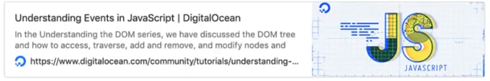

# Ko'p uchraydigan hodisalar

### Reja:

<details>
    <summary>Ko'p uchraydigan hodisalar</summary>

> <br> 💡 JavaScript dasturimizda ko'pincha quyidagi hodisalar bilan birga ishlaymiz: 
<br>
    - MouseEvents <br>
    - FormEvents <br>
    - KeyboardEvents <br>
<br>

<details>
    <summary>Mouse Events</summary>

> <br> 💡 **Mouse Events -** eng ko'p ishlatiladigan hodisalar qatoriga kiradi. Ular sichqonchaning tugmasini bosish yoki sichqoncha ko'rsatgichini olib borish va harakatlantirishga tegishli bo'lgan hodisalarni o'z ichiga oladi <br><br>

<br>

|Hodisa|Tavsifi|
|-|-|
|click|Sichqoncha bosilib va qo'yib yuborilganda ishga tushadi|
|dblclick|Elementga ikki marta bosilganda ishga tushadi|
|mouseenter|Sichqoncha elementni ustiga kelganda ishga tushadi|
|mouseleave|Sichqoncha elementni tark etganda ishga tushadi|
|mousemove|Sichqoncha elementni ichida harakat qilganda ishga tushadi|

<br>

Misol:

````javascript
    const notifyDoubleClick = () => {
        console.log('Element ikki marta bosildi');
    }

    const btn = document.getElementById('btn');
    btn.addEventListener('dblclick', notifyDoubleClick);
````

</details>

<details>
    <summary>Form Events</summary>

> <br> 💡 **Form Events -** forma bilan ishlaganda yuz beradigan hodisalar <br><br>

|Hodisa|Tavsifi|
|-|-|
|submit|Form jo'natilganda (submit) ishga tushadi|
|focus|Element focus bo'lganda ishga tushadi|
|blur|Element focus yo'qotganda ishga tushadi|

</details>

<details>
    <summary>Keyboard Events</summary>

> <br> 💡 **Keyboard Events -** klaviatura tugmachasini bosish, qo'yib yuborish va bosib ushlab turish kabi hodisalarni o'z ichiga oladi <br><br>

|Hodisa|Tavsifi|
|-|-|
|keydown|Klaviatura tugmasi bosilganda ishga tushadi|
|keyup|Klaviatura tugmasi qo'yib yuborilganda ishga tushadi|
|keypress|Klaviatura tugmasi bosilib turganda ishga tushadi|

<br>

Misol:

````javascript
    document.addEventListener('keydown', event => {
        console.log('key: ' + even.key);
        console.log('code: ' + even.code);
    })
````
### Qo'shimcha foydalanish uchun sayt: 👇
[](https://www.digitalocean.com/community/tutorials/understanding-events-in-javascript)

</details>

</details>
