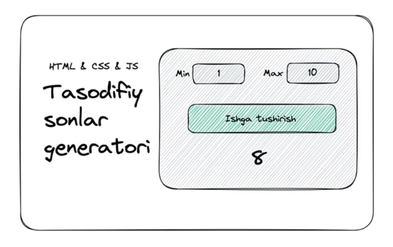
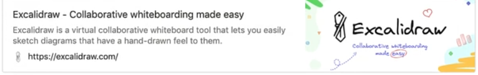

# DOM Amaliyot

### Reja:

<details>
    <summary>Tasodifiy sonlar generator</summary>

<br>

> <br> 💡 JavaScript dasturlash tilidan foydalanib, tasodifiy sonlar generatorini ishlab chiqing <br><br>



### Yuqoridagi kabi diagrammalar chizish uchun link 👇
[](https://excalidraw.com/)

</details>

<details>
    <summary>UI qismi</summary>

> <br> 💡 UI qismini tezlashtirish uchun Bootstrap 5 frameworkidan foydalanilgan <br><br>

````html
    <!DOCTYPE html>
<html lang="en">
<head>
    <meta charset="UTF-8">
    <meta name="viewport" content="width=device-width, initial-scale=1.0">
    <link href="https://cdn.jsdelivr.net/npm/bootstrap@5.2.3/dist/css/bootstrap.min.css" rel="stylesheet" integrity="sha384-rbsA2VBKQhggwzxH7pPCaAqO46MgnOM80zW1RWuH61DGLwZJEdK2Kadq2F9CUG65" crossorigin="anonymous">
    <title>Tasodifiy sonlar generatori</title>
</head>
<body>
    
    <div class="container p-4 mt-4">
        <div class="row align-items-center">
            <div class="col text-center">
                <h3>HTML & CSS & JS</h3>
                <h1>
                    Tasodifiy
                    sonlar 
                    generatori
                </h1>
            </div>
            <div class="col">
                <div class="row">
                    <div class="col">
                        <label for="min" class="form-label">Min</label>
                        <input type="number" class="form-control" id="min">
                    </div>
                    <div class="col">
                        <label for="max" class="form-label">Max</label>
                        <input type="number" class="form-control" id="max">
                    </div>
                </div>
                <div class="d-grid">
                    <button type="button" class="btn btn-primary mt-4 btn-block" id="generate">Ishga tushirish</button>
                </div>
                <h1 class="mt-3 text-center" id="placeholder">
                    #
                </h1>
            </div>
        </div>
    </div>

    <script src="https://cdn.jsdelivr.net/npm/bootstrap@5.2.3/dist/js/bootstrap.bundle.min.js" integrity="sha384-kenU1KFdBIe4zVF0s0G1M5b4hcpxyD9F7jL+jjXkk+Q2h455rYXK/7HAuoJl+0I4" crossorigin="anonymous"></script>
    <script src="./app.js"></script>
</body>
</html>
````

</details>

<details>
    <summary>Funksionallik qismi</summary>

````javascript
    const getRandomNumber = (min, max) => {
        return Math.floor(Math.random() * (max - min + 1)) + min;
    }

    const generate = () => {
        const minEl = document.getElementById('min');
        const maxEl = document.getElementById('max');
        const min = Number(minEl.value);
        const max = Number(maxEl.value);

        if(minEl.value === '' || maxEl.value === '') {
            alert('Iltimos, min va max qiymatlarini kiriting !');
            return;
        }
        
        if(min > max) {
            alert("Min max dan kichik bo'lishi kerak !");
            return;
        }

        const placeholderEl = document.querySelector('#placeholder');
        placeholderEl.textContent = getRandomNumber(min, max);
    }

    const btnEl = document.getElementById('generate');
    btnEl.addEventListener('click', generate);

````

</details>