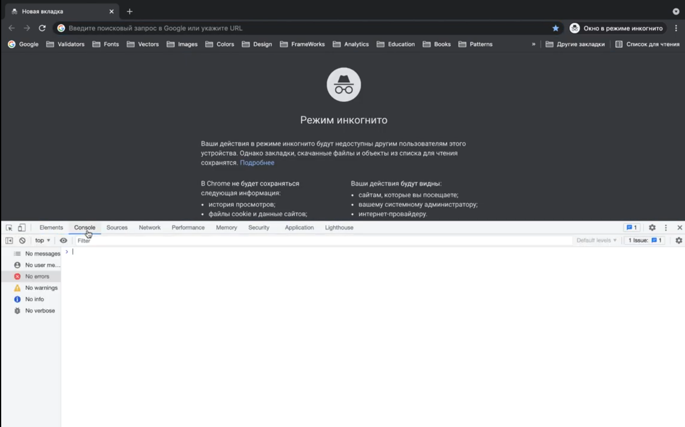

# Salom dunyo

### Reja:

<details>
    <summary>Developer Console</summary>

> <br>💡 **Developer console** dan JavaScript kodni tezda ishga tushirish uchun foydalaniladi:  <br><br>



<br>

````javascript
    alert('Salom dunyo');
````

</details>

<details>
    <summary>Online IDE</summary>
</details>

<details>
    <summary>JavaScript fayl ulash</summary>

<br>

### JavaScript asosan 2xil ko'rinishda veb-sahifaga bog'lanadi:

* `<script>` tegi orasiga kerakli javascript kodlar ketiladi va veb-sahifa ochilganda ishga tushadi.

<br>

````html
<!DOCTYPE html>
<html>
    <head>
        <title>JavaScript</title>
        <script>
            alert('Salom dunyo');
        </script>
    </head>
    <body>
        ...
    </body>

</html>
````

* `<script>` tegining `src` attributi orqali tashqi JS fayl ulanadi

````html
<!DOCTYPE html>
<html>
    <head>
        <title>JavaScript</title>
    </head>
    <body>
        ...

        <script src="./app.js"></script>
    </body>

</html>
````
````javascript
    alert('Salom Dunyo');
````

</details>