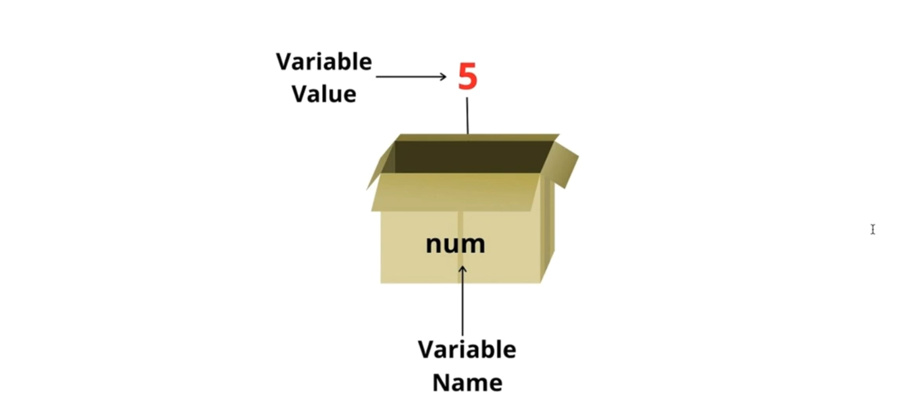

# Qiymatlar va o'zgaruvchilar

### Reja:

<details>
    <summary>Qiymatlar</summary>
    
> <br> 💡 **Qiymat -** eng kichik ko'rinishdagi ma'lumot yoki ma'lumot bo'lagi <br><br>

<br>

````javascript
    "John"
    "Doe"
     20
     4.99
````

</details>

<details>
    <summary>O'zgaruvchilar</summary>

> <br> 💡 **O'zgaruvchi (variable) -** o'zida ma'lum bir qiymatni saqlovchi konteyner (container) <br><br>

<br>

#### O'zgaruvchi quti ko'rinishida



<br>

        O'zgaruvchini qutiga o'xshatishimiz mumkin. Uning ichiga narsalarni solib, qutiga nom berib, belgilab qo'yishimiz mumkin bo'ladi. Keyinchalik shu belgi orqali izlab topish imkoniyatiga ega bo'lamiz

````javascript
    let firsName = 'John';
    let lastName = 'Doe';
    let age = 20;
    console.log(firstName);
    console.log(lastName);
    console.log(age);
````

<br>

### O'zgaruvchilarni e'lon qilish

        O'zgaruvchilarni e'lon qilingandan keyinggina ishlatish imkoniyati mavjud. E'lon qilinmagan o'zgaruchini ishlatish xatolikka olib keladi
    
````javascript
    console.log(name);
    let name = 'John';
````

<br>

### O'zgaruvchilarga nom berish

> <br> 💡 O'zgaruvchilarga nom berayotganda, u o'zida qanday ma'lumotni saqlashini hisobga olib, berilgan nom o'zida saqlayotgan ma'lumotni ifoda etib turishi kerak. O'zgaruvchilar odatda <span style="color: coral">camelCase</span> ko'rinishida yoziladi <br><br>

<br>


````javascript
    let name = 'John';
    let var = 'John';  

    let userNomi = 'john';
    let user_nome = 'john';
````

### O'zgaruvchining nomi quyidagi qoidalarga amal qilishi lozim:

* O'zgaruvchining nomida bo'sh joy (space) bo'lishi mumkin emas

* O'zgaruvchining nomi harf, pastgi chiziqcha (_) yoki dollar belgisi ($) bilan boshlanishi shart

* O'zgaruvchining nomi faqatgina harf, raqam, pastgi chiziqcha, yoki dollar belgisidan tashkil topishi shart !

* Ma'lum bir zaxiralangan nomlarni (reserved words) o'zgaruvchi nomiga berish ta'qiqlanadi

* O'zgaruvchilar nomi camel-sensitive ya'ni katta-kichik harflarni turli xil deb qa'bul qiladi 

````javascript
    let width space = 'widthSpace';
    let 1StartsWithNumber = 'startsWithNumber';
    let other@SymbolUsed = 'otherSymbolUsed';
    let for = 'Reserved word';
    let firstName = 'John';
    let firsTName = 'John';
````

</details>